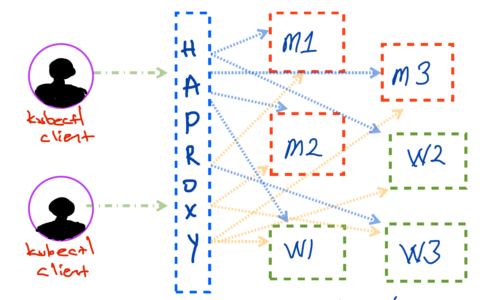
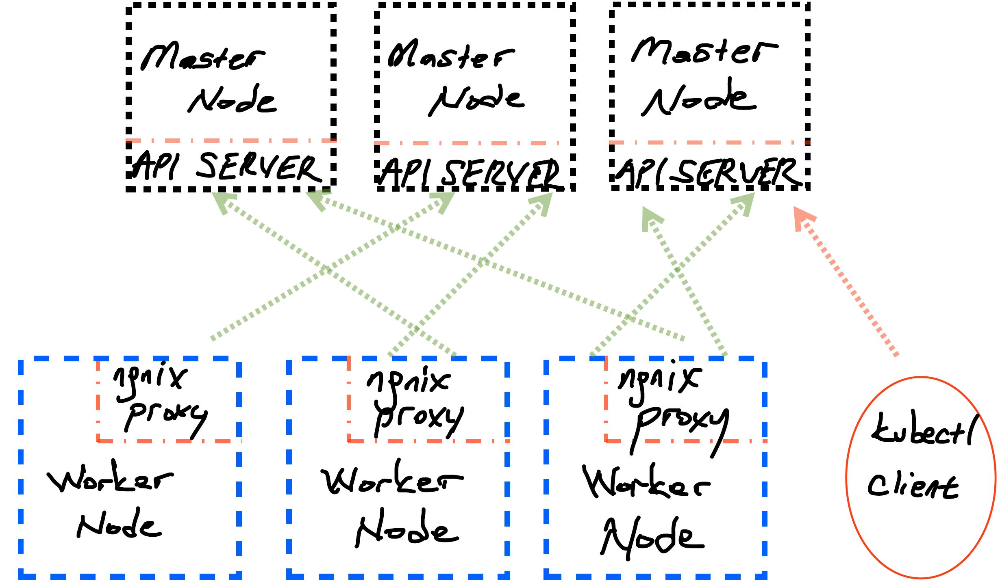

The main purpose of this blog post a simple walkthrough of setting up Kubernetes cluster with external [HAProxy](http://www.haproxy.org/) which will be the endpoint where our `kubectl` client communicates over. 
Node specifications for this setup is given as shown in the table below. Keep in mind that all of them has access to each other with password and without password. The environment which Kubernetes cluster will stay is running on OpenStack. It means that once a configuration (ssh keys, hosts, and etc) is done for example master 1 then all other nodes could be initialized through snapshot of master 1. To be able to setup such a Kubernetes cluster easily, I will be using [KubeSpray](https://github.com/kubernetes-sigs/kubespray)  which is a repository where it has all required configuration and playbooks for setting up necessary cluster. 

- [Node Specification](#node-specification)
- [Prerequisites](#prerequisites)
- [General Overview](#general-overview)
- [KubeSpray Configuration](#kubespray-configuration)
- [External Load Balancer Setup (HAProxy)](#external-load-balancer-setup-haproxy)
- [Setup KubeSpray Configuration](#setup-kubespray-configuration)


The intention of this walkthrough is that setting up your own Kubernetes cluster in your own servers, this post is not very useful for people who are already using cloud provider solutions.(Kubernetes cluster as a service). You can checkout following resources listed below : (few of them :) )

Cloud Providers Solutions:

- [Azure Kubernetes Service - AKS](https://azure.microsoft.com/en-us/services/kubernetes-service/)
- [Google Kubernetes Engine - GKE](https://cloud.google.com/kubernetes-engine)
- [Managed Kubernetes on DigitalOcean](https://www.digitalocean.com/products/kubernetes/)
- [Kubernetes on AWS](https://aws.amazon.com/kubernetes/)


# Node Specification

Kubernetes cluster will be setup on following nodes in the table below, note that HAProxy will run on another node and all ansible playbooks and setting up Kubernetes cluster will be managed through HAProxy. Keep in mind that all nodes + HAProxy is under same subnet internally which means that we will only one external IP address where HAProxy use and `kubectl` clients communicate. All instances are running on ubuntu_18.04, it means that the instructions and steps may not work with another system. 

<style type="text/css">
.tg  {border-collapse:collapse;border-color:#9ABAD9;border-spacing:0;  margin-left: auto; margin-right: auto;}
.tg td{background-color:#EBF5FF;border-color:#9ABAD9;border-style:solid;border-width:1px;color:#444;
  font-family:Arial, sans-serif;font-size:14px;overflow:hidden;padding:10px 5px;word-break:normal;}
.tg th{background-color:#409cff;border-color:#9ABAD9;border-style:solid;border-width:1px;color:#fff;
  font-family:Arial, sans-serif;font-size:14px;font-weight:normal;overflow:hidden;padding:10px 5px;word-break:normal;}
.tg .tg-pwe8{background-color:#fe0000;color:#ffffff;font-weight:bold;text-align:left;vertical-align:top}
.tg .tg-0lax{text-align:left;vertical-align:top}
.tg .tg-amwm{font-weight:bold;text-align:center;vertical-align:top}
</style>
<table class="tg">
<thead>
  <tr>
    <th class="tg-0lax"></th>
    <th class="tg-amwm">Master Nodes</th>
    <th class="tg-amwm">Specs</th>
    <th class="tg-amwm">Worker Nodes</th>
    <th class="tg-amwm">Specs<br></th>
  </tr>
</thead>
<tbody>
  <tr>
    <td class="tg-pwe8">M/W1<br></td>
    <td class="tg-0lax">10.0.128.149</td>
    <td class="tg-0lax">4 VCPU<br>32 GB RAM<br></td>
    <td class="tg-0lax">10.0.128.81</td>
    <td class="tg-0lax">2 VCPU<br>16 GB RAM</td>
  </tr>
  <tr>
    <td class="tg-pwe8">M/W2</td>
    <td class="tg-0lax">10.0.128.171</td>
    <td class="tg-0lax">2 VCPU<br>16 GB RAM</td>
    <td class="tg-0lax">10.0.128.137</td>
    <td class="tg-0lax">2 VCPU<br>16 GB RAM</td>
  </tr>
  <tr>
    <td class="tg-pwe8">M/W3</td>
    <td class="tg-0lax">10.0.128.184</td>
    <td class="tg-0lax">2 VCPU<br>16 GB RAM</td>
    <td class="tg-0lax">10.0.128.156</td>
    <td class="tg-0lax">2 VCPU<br>16 GB RAM</td>
  </tr>
</tbody>
</table>


# Prerequisites

- Nodes
- [Requirements](https://github.com/kubernetes-sigs/kubespray/blob/master/requirements.txt) of KubeSpray
- Setting up SSH Key Across Nodes 
- Getting snapshot ( -it is optional -)
- Setting up login with password


# General Overview 

The following sketch is general overview of how Kubernetes cluster will look like at the end of this walkthrough, the figure is super overviewed version of cluster. 





In given figure above, nodes do not have any external IP adress however, including HAProxy, all of them in same subnet, only HAProxy has external IP address which will be reachable by `kubectl` clients.


Before moving installation step of Kubernetes cluster, we need to setup a sample master node (instance) with predefined configuration. Since we will have only one server which is open to outside world, we need to make sure that there is a connection between HAProxy and sample master node. I am currently calling it sample master node, it is because,  preliminary configurations such as authentication with password, disabled swap area and ssh keys will be all configured. This sample master node should be started and accesible over HAProxy, which means that in  order to access to sample master node, I should do following;

- SSH to HAProxy using SSH key (**Password Login disabled**) like `ssh -i ~/.ssh/id_rsa <username>@<ha-proxy-external-ip>`
- Copy SSH Key to HAProxy, which let you in to sample master node
- Then SSH to sample master node with same approach. (`ssh ~/.ssh/masternode.pem <username>@<master-node-ip>`

After you are inside sample master node, now, some configurations and setting should be done. Afterwards, we can initialize other five nodes from snapshot of configured sample master node. 

Steps: 

- **Enable Password Login if not enabled already.**

```bash 
$ echo "PermitRootLogin yes" >> /etc/ssh/sshd_config
$ sed -i -E 's/PasswordAuthentication no/PasswordAuthentication yes/g' /etc/ssh/sshd_config
```

-  **Specify Password for ROOT**

```bash 
$ sudo su 
$ passwd 
```
Given commands will ask new unix password for root user. Define the password and do not forget or lose it. Since we will gonna use snapshot of this configured machine, all settings will be same, I did like that to shortcut the process. 

- **Disable swap area  (RUN ALL COMMANDS AS ROOT)**

```bash 
$ swapoff -a
```

Afterwards, exit from sample master node, create snapshot of that node (it is called volume snapshot in OpenStack), once you have successfully created snaphot, all five other nodes should be initialized from snapshot of this sample master node. This way, there is no need to repeat same steps described above.

In case of not having possibility to create snapshot follow given steps (if and if only, you could NOT create snapshot and initialize other five nodes from the snapshot)

-  Create all nodes (workers and masters)

-  Enable SSH connection to all nodes from HAPRoxy server. 

From HAProxy server, execute following steps. (-Make sure that you have configured SSH connection with ROOT priviledges and have access to all nodes from HAProxy node -)
  
Once you are sure that you have SSH access to all nodes from HAProxy through SSH, implement following steps. 

- **Install parallel-ssh (-to run a command in parallel on nodes-) (run with ROOT priviledges)**

```bash
$ apt-get update && apt-get install -y pssh
```
-  **Install HAProxy (as ROOT priviledges)**
  
```bash 
$ apt-get install -y haproxy 
```

- **Modify `/etc/hosts` (-For easy communication through nodes-)**

*Append worker and master node IPs to `/etc/hosts` file*

```bash 
$ vim /etc/hosts 
10.0.128.156 worker3
10.0.128.137 worker2
10.0.128.81  worker1
10.0.128.184 master3
10.0.128.171 master2
10.0.128.149 master1
```

- **Create `nodes` text file on home directory**

```bash 
$ cat nodes 
worker3
worker2
worker1
master3
master2
master1
```
*Since IP addresses of them defined in `/etc/hosts` file, system can now recognize and connect IPs of them through just by name*

- **Generate and Copy SSH Key to all nodes** (Required for easy communication)

If there is already a SSH key (like in `~/.ssh/id_rsa`), you can use it as well.If not, you can do following step

```bash 
$ ssh-keygen  # will prompt passphrase, you can leave empty , NOTE THAT IF YOU DO NOT HAVE SSH KEY, GENERATE IT.

$ for i in $(cat nodes); ssh-copy-id $i; done  
```
The for loop given as second command will copy ssh key to all nodes, then accesing any node without password will be flawless.Like given command below; 

```bash 
$  ssh master1  # in defualt uses same username with terminal session
```


- **Disable swap area on all nodes (Note that if you are using snapshot method, no need to do this step)**

```bash 
$ parallel-ssh -h nodes -i "swapoff -a"
```
Parallel SSH tool is handy to complete tasks in parallel for multiple hosts. 


# KubeSpray Configuration

KubeSpray is a repository  to setup Kubernetes clusters with predefined  configuration settings using Ansible playbooks. The usage of KubeSpray is pretty straightforward, as default settings, KubeSpray is using internal load balancers in each worker node,  which means that when you setup a Kubernetes cluster using default values of KubeSpray, you will have following arch overview. 





However, in this guide, external load balancer approach will be used to setup cluster, if you wish to leave everything as default with KubeSpray, you can skip this [External Load Balancer Setup](#external-load-balancer-setup) part. 


# External Load Balancer Setup (HAProxy)

Modify configuration file of HAProxy to enable external LoadBalancer, copy this following configuration and append to `/etc/haproxy/haproxy.cfg`. (end of file)

```cfg
listen kubernetes-apiserver-https
  bind <your-haproxy-internal-ip>:8383
  mode tcp
  option log-health-checks
  timeout client 3h
  timeout server 3h
  server master1 <your-master1-ip>:6443 check check-ssl verify none inter 10000
  server master2 <your-master2-ip>:6443 check check-ssl verify none inter 10000
  server master3 <your-master3-ip>:6443 check check-ssl verify none inter 10000
  balance roundrobin

```

Balance algorithm is `roundrobin` however you can change it from list of available [balance algorithms](https://cbonte.github.io/haproxy-dconv/configuration-1.4.html#4.2-balance) provided by HAProxy. 

Once it is done, save and restart HAProxy service. 

```bash 
$ systemctl restart haproxy
```

# Setup KubeSpray Configuration

Since external load balancer will be used, there is few things to be done to change default values in KubeSpray. Following steps will be done on HAProxy node.

- **Clone the project and prepare environment**
  
```bash 

$ git clone https://github.com/kubernetes-sigs/kubespray
$ apt-get install -y python3-pip # install pip3 if not installed
$ cd kubespray
```

- **Follow the guide on KubeSpray README.md file**

Following instructions taken from [KubeSpray README.md](https://github.com/kubernetes-sigs/kubespray)

```bash 
# Install dependencies from ``requirements.txt``
sudo pip3 install -r requirements.txt
# Copy ``inventory/sample`` as ``inventory/mycluster``
cp -rfp inventory/sample inventory/mycluster
# Update Ansible inventory file with inventory builder
declare -a IPS=(10.0.128.149 10.0.128.171 10.0.128.184 10.0.128.81 10.0.128.137 10.0.128.156)
CONFIG_FILE=inventory/mycluster/hosts.yaml python3 contrib/inventory_builder/inventory.py ${IPS[@]}
```

- **Modify generate hosts YAML file**

When you check `inventory/mycluster/hosts.yaml` file, you will notice that it created two master nodes, which we require three, add missing one properly to that list as shown below. 

```yaml
all:
  hosts:
    master1:
      ansible_host: 10.0.128.149
      ip: 10.0.128.149
      access_ip: 10.0.128.149
    master2:
      ansible_host: 10.0.128.171
      ip: 10.0.128.171
      access_ip: 10.0.128.171
    master3:
      ansible_host: 10.0.128.184
      ip: 10.0.128.184
      access_ip: 10.0.128.184
    worker1:
      ansible_host: 10.0.128.81
      ip: 10.0.128.81
      access_ip: 10.0.128.81
    worker2:
      ansible_host: 10.0.128.137
      ip: 10.0.128.137
      access_ip: 10.0.128.137
    worker3:
      ansible_host: 10.0.128.156
      ip: 10.0.128.156
      access_ip: 10.0.128.156
  children:
    kube-master:
      hosts:
        master1:
        master2:
        master3:
    kube-node:
      hosts:
        master1:
        master2:
        master3:
        worker1:
        worker2:
        worker3:
    etcd:
      hosts:
        master1:
        master2:
        master3:
    k8s-cluster:
      children:
        kube-master:
        kube-node:
    calico-rr:
      hosts: {}
```

Once it is done, the other thing which should be modified to use external load balancer HAProxy, is `all.yaml` file located under  `inventory/mycluster/group_vars/all/`. 

`all.yml` is general configuration file which specifies main configurations of your cluster, it uses Nginx load balancer by default which means that each worker node has its own local nginx load balancer as given second figure above. If not specified anything else. 

- **Disable default load balancer**

```bash
$ vim inventory/mycluster/group_vars/all/all.yml
loadbalancer_apiserver_localhost: false
```

- **Add external load balancer HAProxy.**

```bash 
$ vim inventory/mycluster/group_vars/all/all.yml
## External LB example config
apiserver_loadbalancer_domain_name: "<domain-name-of-lb>"
loadbalancer_apiserver:
  address: 10.0.128.193
  port: 8383
```


- **Initialize cluster deployment**

```bash 
# under kubespray/ directoy 
$ ansible-playbook -i inventory/mycluster/hosts.yaml  --become --become-user=root cluster.yml
```

It will take around 10-15 minutes which depens on your cluster and if everything goes well, at the end of deployment through Ansible you will not face with any problem. If so, you can test it by SSH to `master` node and try `kubectl cluster-info`.

```bash 
$ kubectl cluster-info
Kubernetes master is running at .....

To further debug and diagnose cluster problems, use 'kubectl cluster-info dump'.
```

It means that Kubernetes cluster with three master and  three worker nodes available to use. 

Note that the default configuration of cluster could be changed more however before attempting to change default configuration, make sure that you did correct research on what to change on KubeSpray default settings. Otherwise, there might be problems regarding to customized configuration settings. 
 
For more information stay updated and watch [KubeSpray](https://github.com/kubernetes-sigs/kubespray) regarding to issues, pitfalls and more. 

Last step for this post is creating `kubectl` configuration for your personal/work computer to access the cluster. [Install kubectl](https://kubernetes.io/docs/tasks/tools/install-kubectl/) on your environment. Afterwards copy configuration from master node to your `~/.kube/` as `config`. 

Since we have only one endpoint, configuration file should be copied to HAProxy Server then your computer, through `rsync` or `scp`

- **On HAProxy Server**

```bash 
$ scp root@master1:/etc/kubernetes/admin.conf config  # will copy admin.conf as config 
$ cp config /home/ubuntu/    # copy to a user home dir
$ chown ubuntu:ubuntu /home/ubuntu/config    # change owner of the file 
```  

- **On your personal/work computer**

```bash 
$ scp -i ~/.ssh/haproxy.pem ubuntu@<ha-proxy-ip>:/home/ubuntu/config  ~/.kube/
```

Now, you should be able to get and dump your cluster information as in master nodes. 


```bash 
$ kubectl cluster-info
Kubernetes master is running at .....

To further debug and diagnose cluster problems, use 'kubectl cluster-info dump'.
```

There are lots of configurations and different settings regarding to Kubernetes cluster environment and generally using Cloud Provider solutions are less painful or painless. However, sometimes it is less costly to setup your own environment and  having full access to anything could be better for learning under the hood things or creating highly customized environments. It really depends on your situation therefore it is up to you to go and setup your own Kubernetes cluster or use it as service from cloud providers.

By the way, thanks for giving time to checkout the post 😉 

