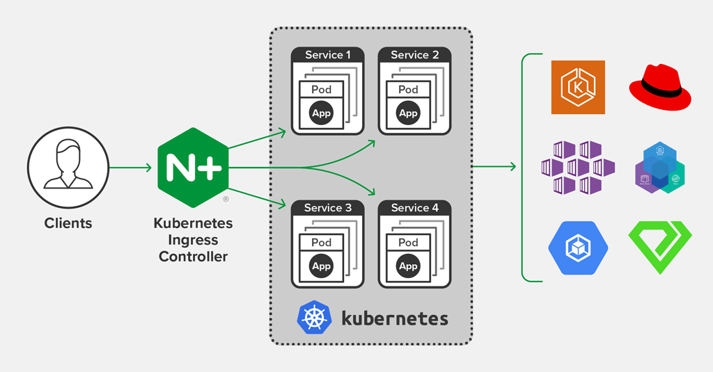
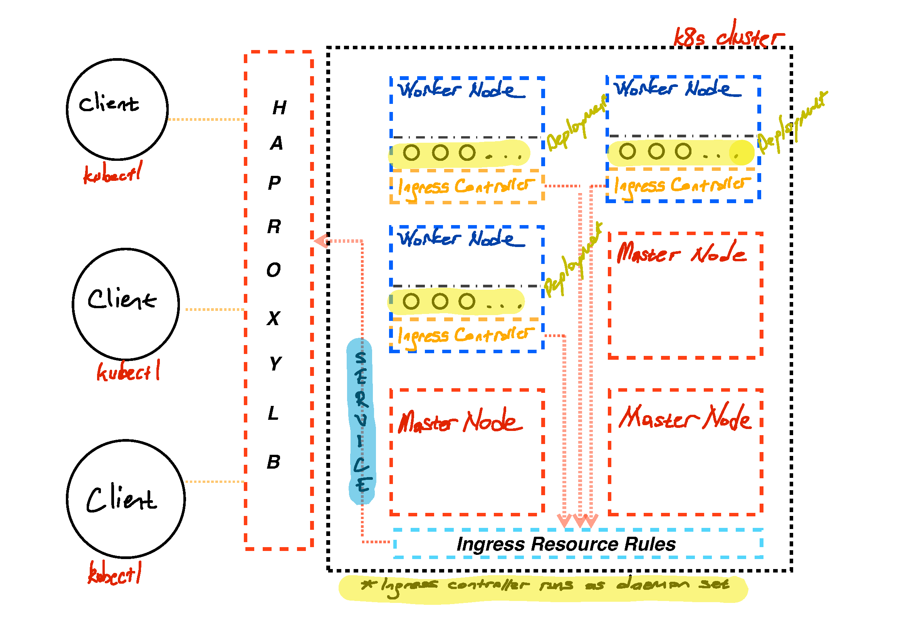
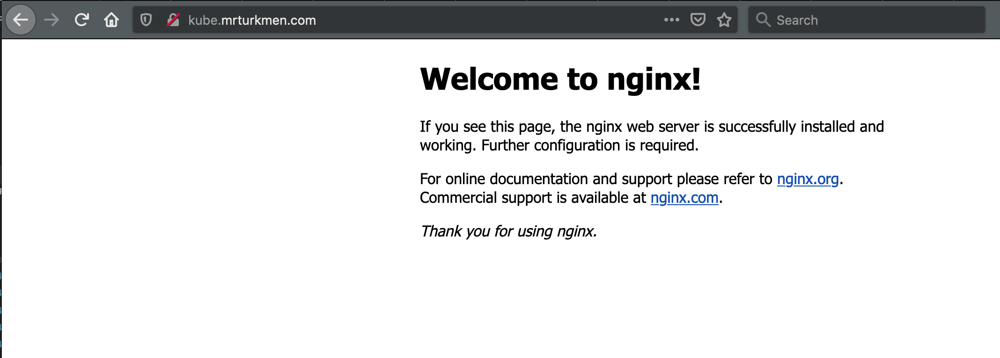

In recent post, which is [Setup Highly Available Kubernetes Cluster with HAProxy 🇬🇧](https://mrturkmen.com/install-ha-kubernetes-cluster/), a highly available Kubernetes cluster is created. However, once I started to dig in and deploy some stuff to cluster, I realized that I am not able to connect any deployed application or services. For instance, when an web application is deployed using HAProxy load balancer (endpoint), and check from `kubectl` (on client side), its status is running. However, that application could not be reached from outside world although I re-patch an external IP address by following command 

```bash 
 $ kubectl patch svc <application-name> -n <name-of-namespace> -p '{"spec": {"type": "LoadBalancer", "externalIPs":["<haproxy-ip-address>"]}}' 
```

After some searching and reading, I realized that worker nodes require their own ingress controllers in order to forward traffic between them in case of load. I will be giving more information of how I fix the issue, however let's learn some basic terms and general information about ingress controller.


- [What is ingress controller ?](#what-is-ingress-controller-)
- [Updates to cluster](#updates-to-cluster)
  - [Setup NGINX Ingress Controller](#setup-nginx-ingress-controller)
    - [Steps to create NGINX Ingress controller](#steps-to-create-nginx-ingress-controller)
  - [Deploy Example Application](#deploy-example-application)


# What is ingress controller ?


The best and simple explanation to this question is coming from Kubernetes official documentation over [here](https://kubernetes.io/docs/concepts/services-networking/ingress/), as they are expressing that ; 

> Ingress exposes HTTP and HTTPS routes from outside the cluster to services within the cluster. Traffic routing is controlled by rules defined on the Ingress resource.

> An [Ingress controller](https://kubernetes.io/docs/concepts/services-networking/ingress-controllers) is responsible for fulfilling the Ingress, usually with a load balancer, though it may also configure your edge router or additional frontend to help handle the traffic. 

Whenever you have services which are running inside a cluster and would like to access them, you need to setup ingress controller for that cluster. The missing part was having no ingress controller on worker nodes in my k8s cluster. Everything was working however there was no access to them from outside world, that's why ingress controller should take place in cluster architecture. 

In this post, I will go for [NGINX ingress controller](https://kubernetes.github.io/ingress-nginx/) with its default setup, however there are plenty of different [ingress controllers](https://kubernetes.io/docs/concepts/services-networking/ingress-controllers/#additional-controllers) which you may go for. I might change NGINX to Traefik in future but it depends on requirements yet for now, I will go with nginx ingress controller. The reason is that, it is super easy to setup, super rich with different features, included Kubernetes official documentation and fulfill what I am expecting for now. 

# Updates to cluster 

Let's briefly what I have explained in previous post;

- Create VMs
- Setup SSH connection
- Use KubeSpray to deploy cluster 
- Create HAProxy and establish SSH connection with all nodes. 

I have noticed that when deploying cluster, some add-ons should be enabled in order to use ingress controller from cluster with external HAProxy load balancer. Now, since cluster deployment was established with Ansible playbooks, it is not needed to setup everything from scratch. All modified configuration can be re-deployed without effecting any resource which is exists on cluster setup. It means that, I can enable required parts in configuration file and re-deploy cluster as I did on previous post. 


-  **Enable ingress controller from [inventory](https://github.com/kubernetes-sigs/kubespray/blob/master/inventory/sample/group_vars/k8s-cluster/addons.yml) file inside KubeSpray**

    ```bash 
    $ vim inventory/mycluster/group_vars/k8s-cluster/addons.yml
    # Nginx ingress controller deployment
    ingress_nginx_enabled: false -> true
    ```

    Once this configuration part is updated from existing KubeSpray configuration files, k8s cluster should be redeployed with same command in [previous post](https://mrturkmen.com/install-ha-kubernetes-cluster/)

    *Assumption* : previous configured KubeSpray settings are used. 

    ```bash 
    $ ansible-playbook -i inventory/mycluster/hosts.yaml  --become --become-user=root cluster.yml
    ```
    It will take a while and update all necessary parts which are required. 

- **Include Ingress API object to route traffic from external HAProxy server to internal services**
  
    To include Ingress API object, HAProxy configuration file should be modified, following lines should be added to `/etc/haproxy/haproxy.cfg` file. 

    ```bash 
    $ vim /etc/haproxy/haproxy.cfg

        frontend kubernetes-ingress-http
            bind *:80
            default_backend kubernetes-worker-nodes-http

        backend kubernetes-worker-nodes-http
            balance leastconn
            option tcp-check
            server worker1 10.0.128.81:80 check fall 3 rise 2
            server worker2 10.0.128.137:80 check fall 3 rise 2
            server worker3 10.0.128.156:80 check fall 3 rise 2
    ```

    In given configuration balancing algorithm is `leastconn` which can be changed into any load balancer algorithm which is supported by HAProxy, however `leastconn` algorithm is fitting more to what I would like to achieve that's why it is declared as `leastconn`. Note that this configuration addition is on top of added part on [previous post](https://mrturkmen.com/install-ha-kubernetes-cluster/). 

    Once HAProxy configuration is updated, HAProxy should be restarted `systemctl restart haproxy`. It is all for HAProxy configuration, now let's dive into setting up NGINX Ingress Controller. 


## Setup NGINX Ingress Controller

It is super simple to deploy and setting up NGINX ingress controller since it is well documented and explains required parts in detail. To setup NGINX Ingress Controller, I will follow official guideline which is exists on  [NGINX Ingress Controller Installation](https://docs.nginx.com/nginx-ingress-controller/installation/).



*Image is taken from ([https://www.nginx.com/products/nginx/kubernetes-ingress-controller/#resources](https://www.nginx.com/products/nginx/kubernetes-ingress-controller/#resources))*

In normal cases, the situation is as given figure above, however, since in existing k8s cluster, I am using HAProxy for communicating with clients, I need NGINX ingress controller inside worker nodes which will manage running applications/services by communicating with HAProxy and eventually, the services will be accessible from outside world. 

If I summarize how overview diagram will look like in my case is like in given figure below. 





It can be observed that, in given k8s cluster overview, HAProxy is in front, it communicates with clients, afterwards transmitting request based on defined rule on HAProxy configuration. Each worker node has NGINX ingress controller, what exactly it means, whenever a request appear to cluster, worker nodes will agree between each other and response back to user without having any problem. Since NGINX ingress controller is capable of load balancing inside worker nodes as well.

There is also Ingress Resource Rules part inside cluster, what it does, is that all routing rules based on path forwarded given service, an example on this is given below. 

### Steps to create NGINX Ingress controller

*All steps shown below for installation of NGINX Ingress Controller taken from [https://docs.nginx.com/nginx-ingress-controller/installation/](https://docs.nginx.com/nginx-ingress-controller/installation/)*

**Make sure that you are a client with administrator privilege, all steps related to NGINX ingress controller  should be done through `kubectl` (on client computer/server)** 


- **Clone Ingress Controller Repo**

```bash 
$ git clone https://github.com/nginxinc/kubernetes-ingress/
$ cd kubernetes-ingress
```

- **Create a namespace and a service account for the Ingress controller**

```bash 
$ kubectl apply -f common/ns-and-sa.yaml
```

- **Create a cluster role and cluster role binding for the service account**

```bash 
$ kubectl apply -f rbac/rbac.yaml
```

- **Create a secret with a TLS certificate and a key for the default server in NGINX**

```bash 
$ kubectl apply -f common/default-server-secret.yaml
```

- **Create a config map for customizing NGINX configuration:**

```bash 
$ kubectl apply -f common/nginx-config.yaml
```

Afterwards, there are two different ways to run NGINX ingress controller deployment, which are as daemonset or as deployment. Main difference between those are summarized on official [installation page](https://docs.nginx.com/nginx-ingress-controller/installation/installation-with-manifests/) as; 

> Use a Deployment. When you run the Ingress Controller by using a Deployment, by default, Kubernetes will create one Ingress controller pod.

> Use a DaemonSet: When you run the Ingress Controller by using a DaemonSet, Kubernetes will create an Ingress controller pod on every node of the cluster.

I will go with DaemonSet approach, the reason is that generally when you have background-ish tasks which will run non-stateless then DaemonSet is more preferred way of running it. 

```bash 
$ kubectl apply -f daemon-set/nginx-ingress.yaml
```

Once it is applied as daemon set, the result could be checked with following command and result will be similar to given result below. 

```bash 
$ kubectl get all 
NAME                      READY   STATUS    RESTARTS   AGE
pod/nginx-ingress-47z8r   1/1     Running   0          24h
pod/nginx-ingress-cmkfq   1/1     Running   0          24h
pod/nginx-ingress-ft5pv   1/1     Running   0          24h
pod/nginx-ingress-q554l   1/1     Running   0          24h
pod/nginx-ingress-ssdrj   1/1     Running   0          24h
pod/nginx-ingress-t9jml   1/1     Running   0          24h

NAME                           DESIRED   CURRENT   READY   UP-TO-DATE   AVAILABLE   NODE SELECTOR   AGE
daemonset.apps/nginx-ingress   6         6         6       6            6           <none>          24h

```

## Deploy Example Application

To test how an application will be exposed to externally from k8s cluster, an example applicaton could be deployed as given below. Note that the following example is simplest example for this context, hence, keep in mind that it might require more configuration and detailed approach then described here when you would like to deploy more complex applications. 

- **Create a sample NGINX Web Server** (Using provided example)

*nginx-deploy-main.yml*
  
```yaml 
apiVersion: apps/v1 # for versions before 1.9.0 use apps/v1beta2
kind: Deployment
metadata:
  name: nginx-deployment
spec:
  selector:
    matchLabels:
      app: nginx
  replicas: 2 # tells deployment to run 2 pods matching the template
  template:
    metadata:
      labels:
        app: nginx
    spec:
      containers:
      - name: nginx
        image: nginx:1.14.2
        ports:
        - containerPort: 80
```

*Taken from [https://kubernetes.io/docs/tasks/run-application/run-stateless-application-deployment/](https://kubernetes.io/docs/tasks/run-application/run-stateless-application-deployment/)*

In given yaml deployment file above, two replicas of NGINX:1.14.2 will be deployed to cluster and it has name of `nginx-deployment`. The yaml explains itself very well. 

It can be deployed either through directly from official link or from your local depends on your preferences. 

```bash 
$ kubectl apply -f https://k8s.io/examples/application/deployment.yaml

## or you can do same thing with local file as given below
$ kubectl apply -f nginx-deploy-main.yml
```
Expose deployment: 

```bash 
$ kubectl expose deploy nginx-deployment --port 80
```

Once it is deployed to cluster and exposed, there is one step left for this simple counter example is that, exposing the service and creating ingress rule (resource) in yaml file, by specifiying kind as `Ingress`. 
 
```yaml
apiVersion: networking.k8s.io/v1beta1
kind: Ingress
metadata:
  name: nginx-ingress
spec:
  rules:
  - host: <dns-record> (a domain like test.mydomain.com)
    http:
      paths:
      - path: /
        backend:
          serviceName: nginx-deployment
          servicePort: 80
```

The crucial part is `serviceName` and `servicePort` which are defining specifications of the services within cluster. The yaml specifications can be expanded as shown below, assume that you have wildcard record in your domain name server and have multiple services which are running in same port in a cluster, yaml file can be re-defined as given below. 

*nginx-ingress-resource.yml*

```yaml
apiVersion: networking.k8s.io/v1beta1
kind: Ingress
metadata:
  name: ingress-controller
spec:
  rules:
  - host: <dns-record> (a domain like test.mydomain.com)
    http:
      paths:
      - path: /
        backend:
          serviceName: nginx-deployment
          servicePort: 80
      - path: /apache
        backend: 
           serviceName: apache-deployment
           servicePort: 80
      - path: /native-web-server 
        backend:
           serviceName: native-web-server-deployment
           servicePort: 80
``` 

Keep in mind that all given services should be deployed before hand otherwise when a request made to any path which is not deployed, it may return either 404 or 500. There are plenty of different options to define and update the components in a k8s cluster. Therefore, all yaml files should be changed according to requirements.

*Create ingress controller rules from provided yaml file*

```bash 
$ kubectl create -f nginx-ingress-resource.yml
```

Now, the NGINX web server deployment is ready on given DNS record in yaml file and according to request paths different services can be called which are also running inside kubernetes cluster. 





Note that, provided yaml files are just simple example of deploying NGINX web server without any certification, when certificates (HTTPS) enabled or any other type of deployment happened different configurations should be applied. 

When everything goes without any problem, you will have a cluster which uses NGINX Ingress controller for internal cluster routing and HAProxy as communication endpoint for clients. Keep in mind that whenever a new service or deployment take place, required configuration should be enabled in HAProxy configuration as it is enabled for port 80 applications above. Different services will have different requirements therefore it is important to catch main logic in a setup. It is all done for this post. 

Cheers ! 