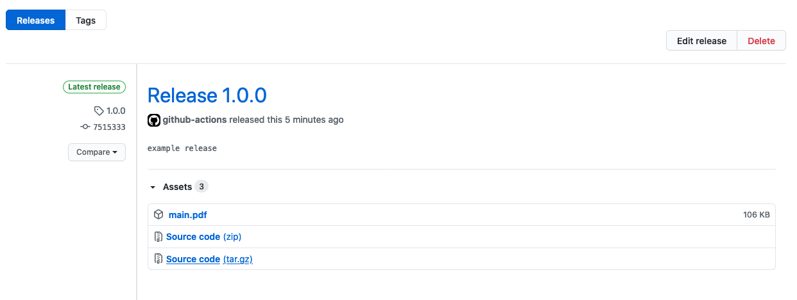

In this post, I will be describing to setup a workflow to build and release your Latex files through Github actions. First of all, keep in mind that this post is not about what is Latex and how to use it.

It is extremely nice to integrate daily development tools such as CI/CD to your preparation of paper, without any hassle. Why is that because it is cool to track of what has been changed on a paper over time. In fact, having a couple of people who are responsible in different parts of paper, sometimes blocks others. Therefore, having such a workflow will increase productivity for everyone in a group.  Whenever pull request created to main branch, it will be easy to check typos, logic errors and missing points by others.

- [Latex preparation](#latex-preparation)
- [Setup Github Actions](#setup-github-actions)
- [Proof of Concept](#proof-of-concept)

## Latex preparation 

I am assuming that you have agreed to work on Latex template to complete a paper. In this case, there is only small step left to do, create a Github repository (-it should be on Github, Github Actions will be used-) and push all files of your Latex template. (-in general, in following structure-)

```raw
    |-sections 
        | introduction.tex
        | related_works.tex
        | problem.tex
        | solution.tex
        | conclusion.tex
    |- main.tex
    |- references.bib
```

The given example structure can be changed according to your wishes, however important and logical part is that having `main.tex` on root directory of repository. 

Once it is set, there is only one step to complete which is setting up Github Action workflows. 

## Setup Github Actions 

There are a few different Github Actions to use for compiling Latex document to PDF on marketplace. Most preferred one is [https://github.com/xu-cheng/latex-action](https://github.com/xu-cheng/latex-action) and it is quite easy to integrate and use. 

It basically creates generated PDF file from provided Latex file, it can be set in workflow file as given below: (- Note that this workflow runs on tagged commits which has a tag with `*.*.*` pattern -)

```yaml
name: Build LaTeX document
on: 
    tags:
        - '*.*.*' # semantic versioning 
jobs:
  build_latex:
    runs-on: ubuntu-latest
    steps:
      - name: Set up Git repository
        uses: actions/checkout@v2
      - name: Compile LaTeX document
        uses: xu-cheng/latex-action@v2
        with:
          root_file: main.tex
```

However, setting up only this job is not sufficient enough to have completed workflow, we require to more jobs which are **Create Release** and **Upload Release**. As you may guess from their name, first one will create the release and second one will upload provided file to releases page. It can be setup as following 

```yaml

name: Release Compiled PDF 
on:
  push:
    tags:
      - '*.*.*'

jobs:
  build_latex:
    runs-on: ubuntu-latest
    steps:
      - name: Set up Git repository
        uses: actions/checkout@v2
      - name: Compile LaTeX document
        uses: xu-cheng/latex-action@v2
        with:
          root_file: main.tex

      - name: Create Release
        id: create_release
        uses: actions/create-release@v1
        env:
          GITHUB_TOKEN: ${{ secrets.GITHUB_TOKEN }}
        with:
          tag_name: ${{ github.ref }}
          release_name: Release ${{ github.ref }}
          draft: false
          prerelease: false

      - name: Upload Release Asset
        id: upload-release-asset 
        uses: actions/upload-release-asset@v1
        env:
          GITHUB_TOKEN: ${{ secrets.GITHUB_TOKEN }}
        with:
          upload_url: ${{ steps.create_release.outputs.upload_url }} 
          asset_path: ./main.pdf
          asset_name: main.pdf
          asset_content_type: pdf
```

The given workflow is completed version of what you might have at the end. In summary, it builds PDF from provided Latex file, creates release and upload file to release. For more details, you can check information on each action page. 

## Proof of Concept

Here is example repository to check completed version. 

[https://github.com/mrturkmencom/latex-on-ci-cd](https://github.com/mrturkmencom/latex-on-ci-cd)




