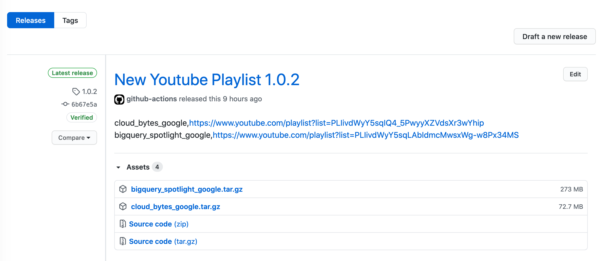

In some moments, Youtube algorithm is working perfect, but sometimes it shows a video from ten years ago from nowhere. For the moments where it shows and suggests videos/playlists to us, we might want to save the list of playlist and watch in some other time. It could be on a plane, train, bus, whenever you are planning to spent some time. However, taking the URL of a playlist and saving it to your cute note program might not be sufficient enough. 
There is a high chance that it will be forgotten or missed, therefore, I thought that it would be nice to have an automated way of saving playlists on somewhere and download them when I need. (- in particular, when there is no or limited internet connection -).

In this blog post, I will go through a simple  project which downloads all the videos in a playlist and generates seperate `tar.gz` files for each playlist to release on Github using Github actions. 

- [Requirements](#requirements)
- [Available Tools](#available-tools)
- [Code Structure](#code-structure)
- [Workflow File](#workflow-file)
- [Github Limitations](#github-limitations)
- [Repository](#repository)
- [Demo](#demo)


## Requirements 

Whenever starting a project, it is always nice to imply [divide and conquer](https://en.wikipedia.org/wiki/Divide-and-conquer_algorithm) approach if you know what you would like to achieve. Divide and conquer approach will hugely assist you during the development and planning no matter what is the size of the project. As first step, let's define what we need for accomblishing such a thing. ]

- A library/program which downloads Youtube videos from given URL. 
- A library/program  which compress the downloaded videos to minimize the size. 
- A workflow on Github Actions to trigger releases. 

When the given components are clarified, only one more step left to have. There should be main component which combines the requirements given above. For this purpose, I will use Go programming language. 

## Available Tools

When existing libraries, tools and open source projects checked for the first requirement, there are some on Github, namely; 

- [annie](https://github.com/iawia002/annie): 👾 Fast, simple and clean video downloader 
- [youtube-dl](https://github.com/rg3/youtube-dl): Command-line program to download videos from YouTube.com and other video sites 
- [you-get](https://github.com/soimort/you-get): Dumb downloader that scrapes the web 
- [ytdl](https://github.com/rylio/ytdl): YouTube download library and CLI written in Go 

These are the tools which enable users to download Youtube videos by providing the URL or the ID.(- some of them supports different social media platforms too, e.g vimeo -).

To make things simpler, I chose to use [youtube-dl](https://github.com/rg3/youtube-dl), since it is more promising than others and formats the output very well according to user output pattern. 

Another point is to clarify which tool/library should I use to compress the downloaded videos from Youtube. With help of a little bit googling, I found out that `pigz` is quite nice tool which compress given folder/file in paralel by using all available cores of the machine. The second requirement is cleared as well, now it is time to combine both of them in one and add Github workflow on top it. 

I will mention about the Github workflow file, after structure of the program which automates the process. 

## Code Structure

To make things faster (- in terms of development time -), I decided to go with using pre-existing binary file to execute commands, what I mean by that is basically having a pre-installed tool (youtube-dl & pigz) on the system before using this application. 

If the readme file of [youtube-dl](https://github.com/ytdl-org/youtube-dl) is checked, youtube-dl can be installed as command line tool into your environment. It means that we can call the tool whenever we need from our application. There are other ways to accomblish it as well, such as instead of using pre-existing binary file, we can implement the functions in our application. However, the main idea of this post is NOT about how to create or use the library, the main idea is to present how it easy to have automated way of retrieving Youtube playlist videos and saving to  Github Releases. 
The other requirement regarding to compress can be used in similar way. (- using a pre-existin command from system -)

To make things simple and extendable (- which means in case of more integration of tools we should be able to accomblish it without changing, many lines of code -), I will generate a main  `Client` struct which will have `exec` function and it will be [overridden](https://en.wikipedia.org/wiki/Method_overriding)  according to command we pass. 

The main client struct : 

```go 
type Client struct {
   
    //youtube-dl client 
    YoutubeDL *YoutubeDL

     // Tar client 
	Tar *Tar

	// Used to enable root command
	sudo bool

	// flags to service
	flags []string

	// enable debug or not
	debug bool

	// Implementation of ExecFunc.
	execFunc ExecFunc

	// Implementation of PipeFunc.
	pipeFunc PipeFunc
}
```
Client struct has some fields which enables us to override whenever we want, the struct contains `exec(cmd string, args ...string) ([]byte, error)`, `shellPipe(stdin io.Reader, cmd string, args ...string) ([]byte, error)`, and `shellExec(cmd string, args ...string) ([]byte, error)` functions. It can be extended according to our requirements in the future. The explanations of the functions are given on top of functions inside the source code. 

For the youtube-dl client, I implemented only a function (-the client functionalities are really easy to extend-), which downloads all videos on given playlist by using pre-existing command line tool youtube-dl. 

```go

package client

type YoutubeDL struct {
	c *Client
}

// exec executes an ExecFunc using 'youtube-dl'.
func (ytdl *YoutubeDL) exec(args ...string) ([]byte, error) {
	return ytdl.c.exec("youtube-dl", args...)
}

// DownloadWithOutputName generates Folder named with Playlist name
// downloads videos under given playlist url to Folder
func (ytdl *YoutubeDL) DownloadWithOutputName(folderName, url string) error {
	cmds := []string{"-o", folderName + "/%(playlist_index)s - %(title)s.%(ext)s", url}
	_, err := ytdl.exec(cmds...)
	return err
}
```
For any other additinal tool to use, it is extremely practical to add, for tar tool I have implemented following for specific purpose ( -which is compressing downloaded videos in paralel- ).

```go

package client

type Tar struct {
	c *Client
}

// exec executes an ExecFunc using 'tar' command.
func (tr *Tar) exec(args ...string) ([]byte, error) {
	return tr.c.exec("tar", args...)
}

// CompressWithPIGZ using tar with pigz compress program to compress given data
func (tr *Tar) CompressWithPIGZ(fileName, folderToCompress string) error {
	cmds := []string{"--use-compress-program=pigz", "-cf", fileName, folderToCompress}
	_, err := tr.exec(cmds...)
	if err != nil {
		return err
	}
	return nil
}
```
Now, it is clear that for the both statements in the requirements section has been done. However, I wanted to keep track of what I have downloaded and release, for this reason, I have created two different csv files. 
They are called `playlist-list.csv` and `old-playlist-list.csv` under resources/ directory in the repository, `playlist-list.csv` will include all list of playlist URLs with preferred folder name to download. Futhermore, as you can guess,  `old-playlist-list.csv` will include all the playlists which are downloaded and released. 
Once the playlist is downloaded and released with Github actions `playlist-list.csv` will be wiped and all content will be appended into `old-playlist-list.csv` file. 

It will give easy way of checking what has been downloaded and released. 

The code for reading and writing to csv files are pretty easy, and can be checked under [main.go](https://github.com/mrturkmencom/youtubeto/blob/master/main.go) in the repository. 

## Workflow File 

The workflow file will include some steps, which are; 

1. [Install pigz](https://github.com/mrturkmencom/youtubeto/blob/004330baeee663dd12a05c4b1aaa99bba5bb4f14/.github/workflows/releaseplaylists.yml#L24) : required to compress data in parallel.
2. [Install youtube-dl](https://github.com/mrturkmencom/youtubeto/blob/004330baeee663dd12a05c4b1aaa99bba5bb4f14/.github/workflows/releaseplaylists.yml#L29) : required to download playlist from given URL. 
3. [Build Binary](https://github.com/mrturkmencom/youtubeto/blob/004330baeee663dd12a05c4b1aaa99bba5bb4f14/.github/workflows/releaseplaylists.yml#L34) : required to have combined binary which handles both download and compress using pre-existing tools on the system. 
4. [Create Release](https://github.com/mrturkmencom/youtubeto/blob/004330baeee663dd12a05c4b1aaa99bba5bb4f14/.github/workflows/releaseplaylists.yml#L38) : the step which initializes releases. 
5. [Run Binary](https://github.com/mrturkmencom/youtubeto/blob/004330baeee663dd12a05c4b1aaa99bba5bb4f14/.github/workflows/releaseplaylists.yml#L51) : executes the program
6. [Upload videos to Github releases](https://github.com/mrturkmencom/youtubeto/blob/004330baeee663dd12a05c4b1aaa99bba5bb4f14/.github/workflows/releaseplaylists.yml#L55) : uploads downloaded content to releases.
7. [Remove  playlist and append downloaded playlists to old list](https://github.com/mrturkmencom/youtubeto/blob/004330baeee663dd12a05c4b1aaa99bba5bb4f14/.github/workflows/releaseplaylists.yml#L61) : updates the list inside the playlist file and commits on master branch. 

The steps given above are clickable to see inside the workflow on repository. 

This small project is created for exclusive purpose, and it is very suitable to extend functionalities. However, there are many gaps regarding to the project such as;

- it does NOT check the given playlists whether they have been already released or not. 
- it does NOT split created tar.gz files into 2 GB splits ( since it is required to have a file on Github releases under 2GB, but there is NO limitation for overall size of files on Github releases.)
- Does NOT have error handling mechanism and more. 

These are the points which appears when the project is checked at first glance, however there are more missing points which could be done. However, the main aim was to give idea how to accomblish automated way of downloading youtube videos and releasing with Github actions. 

I am personally using it for personal needs whenever I find useful playlist, I include it into `playlist-list.csv` file and pushing the changes by tagging the commit in semantic versioning format. 

There are tons of other services which could be integrated such as Slack, Discord, Mail or any another notification systems and more, however, to keep the post short and do not bother you, it is enough for now as it is. 

The rule for the workflow could be easily changed, like instead of running it in tagged commits, it can run in scheduled way by changing run condition only, as shown below. 

```yaml
name: Download & Release Youtube Playlists

on:
  schedule:
    - cron: '0 0 * * *' # it means every day at midnight the workflow will run
```

If you require or would like to have more features, or fixes, suggestions and etc, you are more welcome to open issues. 


## Github Limitations 

Since we are using Github actions, we have some limitations regarding to usage of it. 

The limitations regarding to file sizes in releases, according to Github Statement here:[Distributing large binaries](https://docs.github.com/en/free-pro-team@latest/github/managing-large-files/distributing-large-binaries) 

Basically, a file size which will be uploaded to releases should **NOT** exceeds 2 GB. However, keep in mind that it is per file, there is NO limitation for overall size of release :). It means that repository will be updated to split files into chunks if size of the file exceeds 2 GB. So, in case of 15 GB of playlist, it will be uploaded in 2GB chunks to releases.

There are some more limitations:

**Job execution time** - Each job in a workflow can run for up to 6 hours of execution time. If a job reaches this limit, the job is terminated and fails to complete.

**Workflow run time** - Each workflow run is limited to 72 hours. If a workflow run reaches this limit, the workflow run is cancelled.

More details about limmitations on Github Actions: [Usage Limits](https://docs.github.com/en/free-pro-team@latest/actions/reference/usage-limits-billing-and-administration)

It is good to keep in mind the given limitations above.

Job execution time and Workflow run time can be easily fixed if you have your own server.

If you would like to run Github Actions in your server, there is no limitation regarding to Job execution time and Workflow run time.

Check out how to setup Github Actions for your server from here:

[Setup self hosted runners](https://docs.github.com/en/free-pro-team@latest/actions/hosting-your-own-runners/about-self-hosted-runners)

## Repository

[youtubeto](https://github.com/mrturkmencom/youtubeto): Automated Youtube PlayList Releaser 

## Demo 

[](https://www.youtube.com/watch?v=53ax_T7Q2p4)
