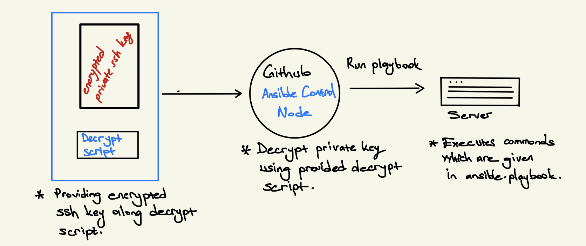
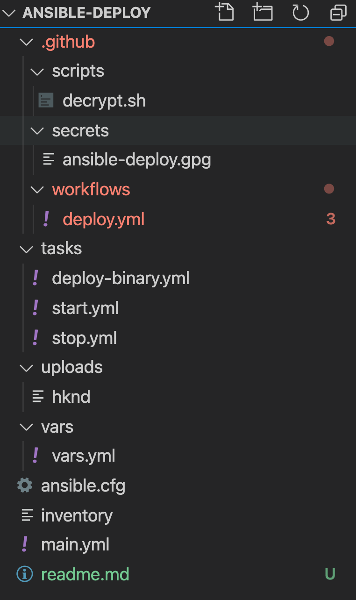
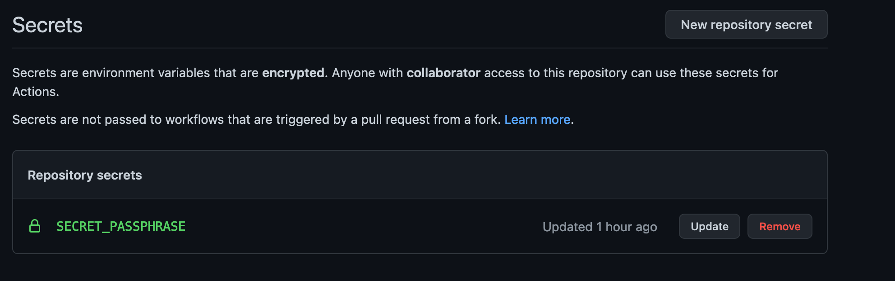
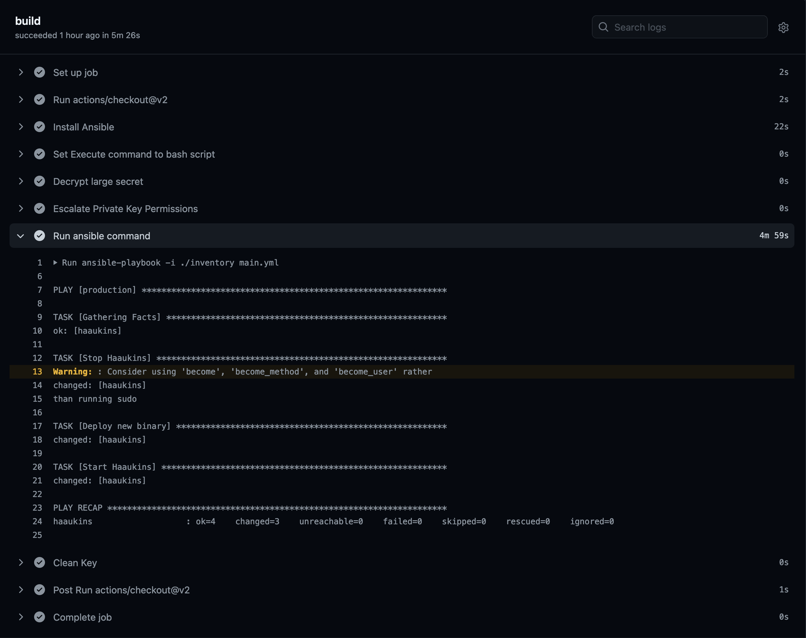

In this post, deployment process of an application with Ansible will be explained. Traditionally applications can be deployed in different ways, quite similar approach to deploy applications like in Ansible is executing bash script which has ssh commands. To give an example, Travis continuous integration has a feature where a bash script can be defined to deploy application and through given instructions within bash script, application can be successfully deployed.

Details regarding to deployment using Travis bash scripting can be found [here](https://docs.travis-ci.com/user/deployment/script/)

## Travis Script Deployment

I would like to give an real case example from one of the project which I work on. We were using Travis script deployment for a while and it works pretty well. The bash script which I use in our deployment process is given below: 

```bash 
#!/usr/bin/env bash
f=dist/hknd_linux_amd64/hknd
amigo=./svcs/amigo
user=ntpd
hostname=sec02.lab.es.aau.dk
keyfile=./travis_deploy_key
deploy_path=/data/home/ntpd/daemon/hknd
amigo_path=/data/home/ntpd/daemon/svcs/amigo

if [ -f $f ]; then
    echo "Deploying '$f' to '$hostname'"
    chmod 600 $keyfile
    ssh -i $keyfile -o StrictHostKeyChecking=no $user@$hostname sudo /bin/systemctl stop hknd.service
    scp -i $keyfile -o StrictHostKeyChecking=no $f $user@$hostname:$deploy_path
    scp -i $keyfile -r -o StrictHostKeyChecking=no $amigo $user@$hostname:$amigo_path
    ssh -i $keyfile -o StrictHostKeyChecking=no $user@$hostname sudo /bin/systemctl start hknd.service
else
    echo "Error: $f does not exist"
    exit 1
fi
```

As you can observe from the bash script, every step of the deployment is given as ssh/scp commands. There is no harm regarding to it as long as it contains few steps. However, as time pass more configurations, applications will required to be deployed, updated, modified and checked, then it might turn into headache. Therefore, having well structured deployment steps using  Ansible will put us to safe side.

Before jumping into deployment with Ansible, I would like to point out some factors which can be counted as disadvantages of not integrating Ansible to deployment process. 

- Not common way of utilizing resources
- Not well structured deployment scripts which has high potential of being not working very well.
- Having plain ssh commands increase likelihood of having issues regarding to settings, deployments and more. 

There are many more drawbacks of using pure bash scripts in deployment process, however, these issues may not be applicable for all them. 

For our case, I would like to convert our bash script given above to Ansible which has more elegant structure and easy to manage. 

## Move to Ansible

Since the bash script does not contain complex instructions, it would be very easy to convert it into Ansible playbooks. Before starting to convert it into Ansible playbook, necessary ssh connection should be set correctly for development and production environments. (- test environment as well if required -). 

Setting ssh connection between server and ansible user is pretty straitforward, it contains following steps;

- Generate SSH Key pair
- Copy public key to `authorized_keys` on server side
- Encrypt private key 
- Have decrypt script to use private key on CI without compromising it.

Overall simplified flow for deployment is given below :



As it is declared from overall picture above, we need to provide encrypted ssh key and script for decryption together, in order to use plain private key to access the server. 

In this setup, Github CI will be control node which will have access to server where we would like to deploy the application. 

Let's start to complete steps, 

- __Generate SSH Key pair__
  
    ```bash 
    $ ssh-keygen 
    ```
  You can keep everything default or provide some information about the questions when you run it. 
  Once, execution of command finished, there will be public and private key, you need to append the public key to user' authorized keys file on server. 
  Afterwards, connection should be established, you may want to test it using traditional ssh command. 

- __Encrypt Private Key__
  
  In order to use the ssh key which is generated before, we need to encrypt the key, I preferred to use `gpg` tool, there are many examples about it on internet, you can check it if you wish. 

  ```bash
    $ gpg --symmetric --cipher-algo AES256 <private-key-file>
  ```

  The command will prompt you to provide passphrase to encrpyt and decrypt the private key when required. Choose strong and long passphrase.
  Once it is done, include encrpyted file into git. (- which means commit it as well-)

Once they have completed, the rest is structing Ansible playbook to deploy the file to server. 

## Example Repo


I am going to create a repository on Github to demonstrate what I have described earlier in action. 

For the demo purposes, I will upload a service file to server and start it, simplified version of given bash commands above.

Ansible playbook will contain following;

- Stopping already running service 
- Changing binary file of the service
- Starting it again

The tasks can be extended according to user needs however to keep it short and show how Ansible could be used on continuous integration, I will continue to have minimal playbook. 

Link to example repository: [https://github.com/mrturkmenhub/ansible-deploy](https://github.com/mrturkmenhub/ansible-deploy)

The structure of the repository as following: 





As it can be observed from the figurre above, I have only three tasks which are combined under [main.yml](https://github.com/mrturkmenhub/ansible-deploy/blob/master/main.yml). 

Some configuration regarding to Ansible, such as private key, inventory file location declaration is saved to file [ansible.cfg](https://github.com/mrturkmenhub/ansible-deploy/blob/master/ansible.cfg) among ssh connection configuration. 

[Inventory](https://github.com/mrturkmenhub/ansible-deploy/blob/master/inventory) file contains server(s) to deploy the application. 

This post is not about how to write ansible playbooks, hence, I am going to skip to explain it. If you would like to check and understand it you can check following repositories for examples; 

 - [DevOps Learning Journey][https://github.com/mrturkmenhub/DevOps-Learning-Journey] 
 - [Handwritten notes about Ansible](https://mrturkmen.com/assets/notes/20201205-introduction-to-ansible.pdf)

[Decrypt script](https://github.com/mrturkmenhub/ansible-deploy/blob/master/.github/scripts/decrypt.sh) is most important file which is decrypting encrypted private key to access the server. 

**DO NOT FORGET TO SET YOUR SECRET_PASSPHRASE TO SECRETS OF THE REPOSITORY**




## The workflow file

The workflow file for this repository is pretty straitforward to create as well, what needs to be done is that ansible should be installed into environment. Afterwards, running ansible playbook command after decrpyting the encrypted private key will complete the tasks.

The generated workflow is for giving demonstration, in normal production case, the pipeline should **NOT** be broken, each step from testing to production deployment should be as much as automated. 

The completed workflow file: 

```yaml
# This is a basic workflow to help you get started with Actions

name: CI

# Controls when the action will run. 
on:
  # Triggers the workflow on tagged commits  
  push:
    tags:
      - '*.*.*'

  # Allows you to run this workflow manually from the Actions tab
  workflow_dispatch:

# A workflow run is made up of one or more jobs that can run sequentially or in parallel
jobs:
  # This workflow contains a single job called "build"
  build:
    # The type of runner that the job will run on
    runs-on: ubuntu-latest

    # Steps represent a sequence of tasks that will be executed as part of the job
    steps:
      # Checks-out your repository under $GITHUB_WORKSPACE, so your job can access it
      - uses: actions/checkout@v2
      
      - name: Install Ansible
        run: |
          sudo apt update -y
          sudo apt install software-properties-common -y
          sudo apt-add-repository --yes --update ppa:ansible/ansible
          sudo apt install ansible -y
     
      - name: Set Execute command to bash script
        run: chmod +x ./.github/scripts/decrypt.sh
    
      # Runs a single command using the runners shell
      - name: Decrypt large secret
        run: ./.github/scripts/decrypt.sh
        env:
          SECRET_PASSPHRASE: ${{ secrets.SECRET_PASSPHRASE }}
        
      - name: Escalate Private Key Permissions
        run: chmod 400 ~/.privkey

      - name: Run ansible command
        run: |
          ansible-playbook -i ./inventory main.yml
        env:
          ANSIBLE_CONFIG: ./ansible.cfg

      - name: Clean Key
        run: rm -rf ~/.privkey
```


The final result from Github actions: 



Keep in mind that this is just a minor portion of a long pipeline which has all unit tests, checks, linting and integration tests. Without proper pipeline in place, having Ansible might not be logical or required. Consider your cases when you would like to move to deployment with Ansible. 

Cheers ! 


