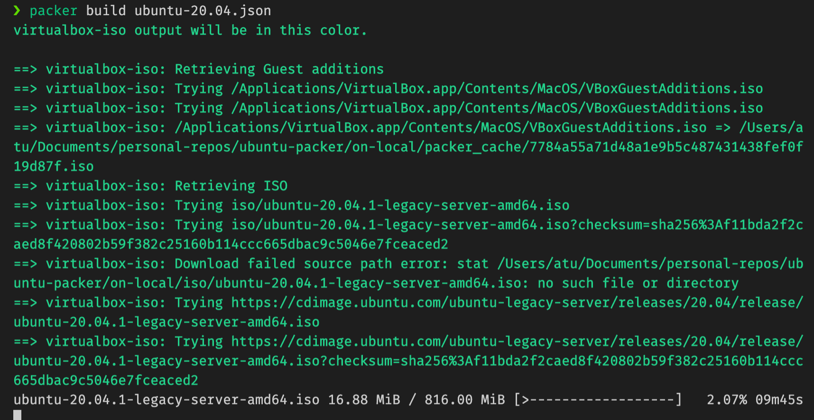
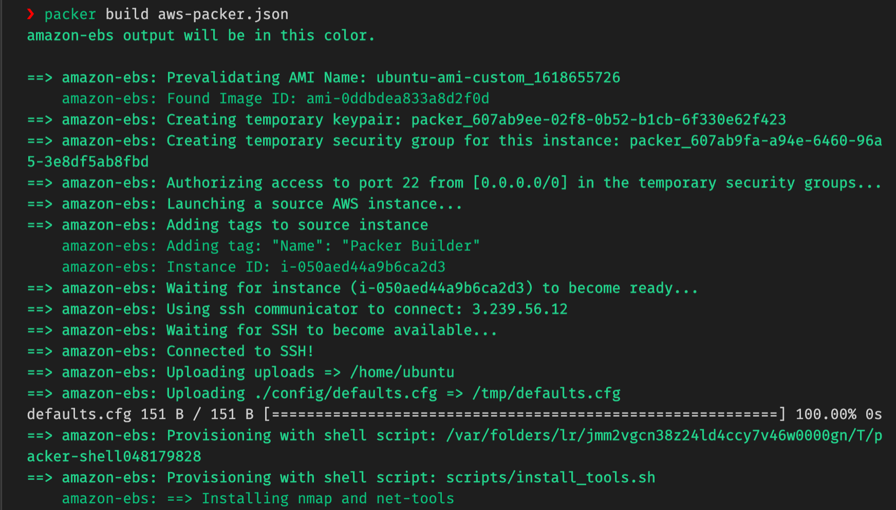

- [Build Custom Ubuntu 20.04 LTS on Local](#build-custom-ubuntu-2004-lts-on-local)
  - [Anatomy of Packer Configuration File](#anatomy-of-packer-configuration-file)
    - [Builders](#builders)
    - [Provisioner](#provisioner)
    - [Post Processors](#post-processors)
    - [Communicator](#communicator)
  - [How to run locally](#how-to-run-locally)
- [Build Custom Ubuntu 20.04 LTS on Cloud](#build-custom-ubuntu-2004-lts-on-cloud)
  - [Builders on Cloud](#builders-on-cloud)
  - [Customize settins on Cloud](#customize-settins-on-cloud)
  - [How to run](#how-to-run)


---- 
 __THE REPOSITORY: [https://github.com/mrtrkmnhub/ubuntu-packer](https://github.com/mrtrkmnhub/ubuntu-packer)__


In this blog post, provisioning and customizing images using packer will be shown with a template repository. 

If you are asking or wondering what is Packer, the official definition is : 

> Packer is a free and open source tool for creating golden images for multiple platforms from a single source configuration.  (From Official Website).

This post includes provisioning of ubuntu image on AWS and local. 

# Build Custom Ubuntu 20.04 LTS on Local

In an ideal repository of Packer template, it would be nice to have a skeleton where it includes `uploads`, `http`, `scripts` folders along packer configuration file with a readme. Overall, the structure of folder might look like this : 

```bash 

    ├── http
    │   └── preseed.cfg     # required to change defualt values of ubuntu  image
    ├── readme.md           # readme file to have instructions about what to do
    ├── scripts             # scripts/ dir, includes scripts to run on custom image
    │   ├── cleanup.sh          # cleans up /tmp 
    │   ├── install_tools.sh    # installs custom tools
    │   └── setup.sh            # setting up config in system wise
    ├── ubuntu-20.04.json       # packer config for ubuntu 20.04
    └── uploads                 # directory to upload files to custom image 
        └── .gitkeep    
```

In this setup, `http/preseed.cfg` defines answers to the questions which may be asked during installation of Ubuntu operating system. More information regarding to *preseed.cfg* file can be checked from [its wiki](https://wiki.debian.org/DebianInstaller/Preseed)

- `scripts` folder composed of bash scripts, chef, ansible or any other installer configuration files or scripts which will install customized tools and define settings of ubuntu image. 

- `uploads` folder includes all files, deb packages, or any other files which will be copied to image which will be inside customized image.

## Anatomy of Packer Configuration File 

Any packer file composed of three main components which are ; 

### Builders 
 
 Define the desired platform and platform configurations, including API Key information and desired source images. Example snippet is given from the Packer file: 

 ```json

    "builders": [
    {
      "boot_command": [
        "<esc><wait>",
        "<esc><wait>",
        "<enter><wait>",
        "/install/vmlinuz<wait>",
        " auto<wait>",
        " console-setup/ask_detect=false<wait>",
        " console-setup/layoutcode=us<wait>",
        " console-setup/modelcode=pc105<wait>",
        " debconf/frontend=noninteractive<wait>",
        " debian-installer=en_US<wait>",
        " fb=false<wait>",
        " initrd=/install/initrd.gz<wait>",
        " kbd-chooser/method=us<wait>",
        " keyboard-configuration/layout=USA<wait>",
        " keyboard-configuration/variant=USA<wait>",
        " locale=en_US<wait>",
        " netcfg/get_domain=vm<wait>",
        " netcfg/get_hostname=ubuntu<wait>",
        " grub-installer/bootdev=/dev/sda<wait>",
        " noapic<wait>",
        " preseed/url=http://{{ .HTTPIP }}:{{ .HTTPPort }}/preseed.cfg<wait>",
        " -- <wait>",
        "<enter><wait>"
      ],
      "boot_wait": "10s",
      "format": "ova",
      "disk_size": 25240,
      "guest_additions_path": "VBoxGuestAdditions_{{.Version}}.iso",
      "guest_os_type": "Ubuntu_64",
      "headless": true,
      "http_directory": "http",
      "iso_checksum": "sha256:f11bda2f2caed8f420802b59f382c25160b114ccc665dbac9c5046e7fceaced2",
      "iso_urls": [
        "iso/ubuntu-20.04.1-legacy-server-amd64.iso",
        "https://cdimage.ubuntu.com/ubuntu-legacy-server/releases/20.04/release/ubuntu-20.04.1-legacy-server-amd64.iso"
      ],
      "shutdown_command": "echo 'ubuntu'|sudo -S shutdown -P now",
      "ssh_password": "ubuntu",
      "ssh_port": 22,
      "ssh_timeout": "10000s",
      "ssh_username": "ubuntu",
      "type": "virtualbox-iso",
      "vboxmanage": [
        [
          "modifyvm",
          "{{.Name}}",
          "--memory",
          "2048"
        ],
        [
          "modifyvm",
          "{{.Name}}",
          "--cpus",
          "1"
        ]
      ],
      "virtualbox_version_file": ".vbox_version",
      "vm_name": "ubuntu_vm_ubuntu_20_{{timestamp}}"
    }
  ]
 ```

In the builders config, we are defining some set of keys in JSON file, which are very obvious from its name, we are considering to build image locally. All the keys are important in given builders config however most important and might need to update time to time is `iso_urls` which are the places where packer download iamges and customize it according to your scripts. 
Another crucial key is to have `headless` value `true` which means that there will be no GUI running when packer command is executed to run the Packer JSON file. 

### Provisioner

Defines how to configure the image most likely by your using existing configuration management tools like Ansible, Chef, Puppet or pure bash scripts. 

In our example, bash scripts will be provided to install tools and update configuration of ubuntu image to make it customized. Provisioner section of a Packer JSON file can be seen as below: 

```json

 "provisioners": [
    {
      "type": "file",
      "source":"uploads",
      "destination": "/home/ubuntu"
    },
    {
      "execute_command": "echo 'ubuntu' | {{.Vars}} sudo -S -E bash '{{.Path}}'",
      "script": "scripts/install_tools.sh",
      "type": "shell"
    },
    {
      "execute_command": "echo 'ubuntu' | {{.Vars}} sudo -S -E bash '{{.Path}}'",
      "script": "scripts/setup.sh",
      "type": "shell"
    },
    {
      "execute_command": "echo 'ubuntu' | {{.Vars}} sudo -S -E bash '{{.Path}}'",
      "script": "scripts/cleanup.sh",
      "type": "shell"
    }
  ]
```
Here we are defining existing bash scripts in order to execute in the process of customizing Ubuntu image. The steps under provisioners are pretty clear.

- The content of uploads file will be uploaded to home directory `/home/ubuntu`

- In second step, `install_tools.sh` will be executed and other steps will be followed in order. 

### Post Processors

Related to the builder, runs after the image is built, it is generally used to generate or apply artifacts. In this example, it is not required however more information can be found here: [post processors](https://www.packer.io/docs/post-processors)

### Communicator

How packer works on the machine image during the creation. By default it is over SSH communication and it does not need to be defined explicitly. More information can be found here: [communicator](https://www.packer.io/docs/communicators)

Over all packer file can be seen as follow: 

```json 
{
    "builders": [
        {
        "boot_command": [
            "<esc><wait>",
            "<esc><wait>",
            "<enter><wait>",
            "/install/vmlinuz<wait>",
            " auto<wait>",
            " console-setup/ask_detect=false<wait>",
            " console-setup/layoutcode=us<wait>",
            " console-setup/modelcode=pc105<wait>",
            " debconf/frontend=noninteractive<wait>",
            " debian-installer=en_US<wait>",
            " fb=false<wait>",
            " initrd=/install/initrd.gz<wait>",
            " kbd-chooser/method=us<wait>",
            " keyboard-configuration/layout=USA<wait>",
            " keyboard-configuration/variant=USA<wait>",
            " locale=en_US<wait>",
            " netcfg/get_domain=vm<wait>",
            " netcfg/get_hostname=ubuntu<wait>",
            " grub-installer/bootdev=/dev/sda<wait>",
            " noapic<wait>",
            " preseed/url=http://{{ .HTTPIP }}:{{ .HTTPPort }}/preseed.cfg<wait>",
            " -- <wait>",
            "<enter><wait>"
        ],
        "boot_wait": "10s",
        "format": "ova",
        "disk_size": 25240,
        "guest_additions_path": "VBoxGuestAdditions_{{.Version}}.iso",
        "guest_os_type": "Ubuntu_64",
        "headless": true,
        "http_directory": "http",
        "iso_checksum": "sha256:f11bda2f2caed8f420802b59f382c25160b114ccc665dbac9c5046e7fceaced2",
        "iso_urls": [
            "iso/ubuntu-20.04.1-legacy-server-amd64.iso",
            "https://cdimage.ubuntu.com/ubuntu-legacy-server/releases/20.04/release/ubuntu-20.04.1-legacy-server-amd64.iso"
        ],
        "shutdown_command": "echo 'ubuntu'|sudo -S shutdown -P now",
        "ssh_password": "ubuntu",
        "ssh_port": 22,
        "ssh_timeout": "10000s",
        "ssh_username": "ubuntu",
        "type": "virtualbox-iso",
        "vboxmanage": [
            [
            "modifyvm",
            "{{.Name}}",
            "--memory",
            "2048"
            ],
            [
            "modifyvm",
            "{{.Name}}",
            "--cpus",
            "1"
            ]
        ],
        "virtualbox_version_file": ".vbox_version",
        "vm_name": "ubuntu_vm_ubuntu_20_{{timestamp}}"
        }
    ],
    "provisioners": [
        {
        "type": "file",
        "source":"uploads",
        "destination": "/home/ubuntu"
        },
        {
        "execute_command": "echo 'ubuntu' | {{.Vars}} sudo -S -E bash '{{.Path}}'",
        "script": "scripts/install_tools.sh",
        "type": "shell"
        },
        {
        "execute_command": "echo 'ubuntu' | {{.Vars}} sudo -S -E bash '{{.Path}}'",
        "script": "scripts/setup.sh",
        "type": "shell"
        },
        {
        "execute_command": "echo 'ubuntu' | {{.Vars}} sudo -S -E bash '{{.Path}}'",
        "script": "scripts/cleanup.sh",
        "type": "shell"
        }
    ],
    "variables": {
        "version": "0.1"
    }
}

```

## How to run locally 

This file can be run from the place where [ubuntu-20.04.json](https://github.com/mrtrkmnhub/ubuntu-packer/blob/master/on-local/ubuntu-20.04.json) file is located. 

```bash 
$ packer build ubuntu-20.04.json
```




It will start to build custom image by installing tools which are defined under scripts and configure username and password according to preseed.cfg and setup.sh files.


# Build Custom Ubuntu 20.04 LTS on Cloud 

It is more practical and preferrable to use if you already have an cloud option to consider. This packer configuration will create custom image directly on cloud and save it to AMIs to your AWS account. 

The anatomy of packer files is similar, only section which needs to be changed compared to local one, is builders section. It is defining all required AWS variables and AMIs to customize. 

As an cloud example AWS will be used to create custom image. 

## Builders on Cloud 

```json

"builders": [
        {
            "type":"amazon-ebs", 
            "region": "{{user `aws_region`}}", 
            "access_key": "{{user `aws_access_key`}}",
            "secret_key": "{{user `aws_secret_key`}}", 
            "subnet_id": "{{user `aws_subnet_id`}}", 
            "security_group_id": "{{user `aws_security_group`}}", 
            "source_ami_filter": {
                "filters": {
                    "virtualization-type": "hvm", 
                    "name": "ubuntu/images/*ubuntu-focal-20.04-amd64-server-*",
                    "root-device-type": "ebs"
                },
                "owners": ["099720109477"],
                "most_recent": true
            },
            "instance_type": "{{user `instance_type`}}",
            "ssh_username":"ubuntu", 
            "ami_name": "ubuntu-ami-custom_{{timestamp}}"
        }

    ]
```

In this configuration, all keys are important to consider, however there are some which are crucial and required to run it.  More information about the keys can be found here: [Amazon AMI Builder](https://www.packer.io/docs/builders/amazon)

We would like to create a custom  Ubuntu-20.04 image on cloud and save it as AMI to run it later, we are searching its pattern from available AMIs on AWS Management Console or it can be found through out this website : [https://cloud-images.ubuntu.com/locator/ec2/](https://cloud-images.ubuntu.com/locator/ec2/)

Once you have declared which AMI to customize, it needs to be located under `source_ami_filter` with wildcards and owners. Setting `most_recent` to `true` means that when this Packer JSON file is executed it will fetch and customize last updated AMI.

__Access Key, Secret Key__ are required and should not be exposed to public in any moment, if exposed, they need to be updated immediately. They will be used to communicate with AWS to fire up instances to create custom image according to given settings defined in builders and provisioners. 

The values of keys are defined in  __variables__  and  parsed from out of it. 

```json

"variables": {
        "aws_access_key": "",
        "aws_secret_key": "",
        "aws_region": "",
        "aws_vpc": "",
        "aws_subnet": "",
        "ami_name": "",
        "ami_description": "",
        "builder_name": "",
        "username":"ubuntu",
        "instance_type":"t2.medium",
        "tarball": ""
    }, 

```
In variables section,  __username, instance_type, aws_access_key, aws_secret_key__ variables should be set correctly to create the image on cloud. Other variables are optional and variables section can be populated more. 

## Customize settins on Cloud 

On cloud builds, cloud configuration file should be used instead of `preseed.cfg` to customize settings. 
The __defaults.cfg__ file where it contains custom settings such as default username, password, changing visudo file and more. Example __defaults.cfg__ can be as follow: 

```cfg
#cloud-config
system_info:
  default_user:
    name: ubuntu
    sudo: ["ALL=(ALL) NOPASSWD:ALL"]
    lock_passwd: false
    plain_text_passwd: 'ubuntu'
```

More information regarding to __defaults.cfg__ file can be found here and customized more: [https://cloudinit.readthedocs.io/en/latest/topics/examples.html](https://cloudinit.readthedocs.io/en/latest/topics/examples.html)


## How to run 

Once variables are set, it can be run in same way with the local one. 

```bash 

$ packer build aws_packer.json

```




Complete packer JSON file : [aws_packer.json](https://github.com/mrtrkmnhub/ubuntu-packer/blob/master/on-aws/aws-packer.json)

As a summary, Packer is really cool tool to use to automate the process of creating custom images and it can be used for Dockers as well. For local example in this post, it will produce OVA file to import, on cloud it will generate custom AMI under your AWS account. 

All scripts and config files can be found in this repository: [https://github.com/mrtrkmnhub/ubuntu-packer](https://github.com/mrtrkmnhub/ubuntu-packer)


