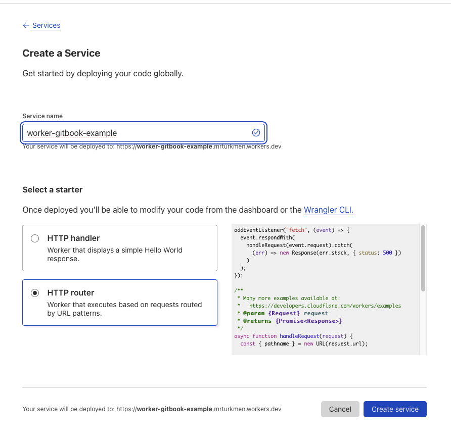
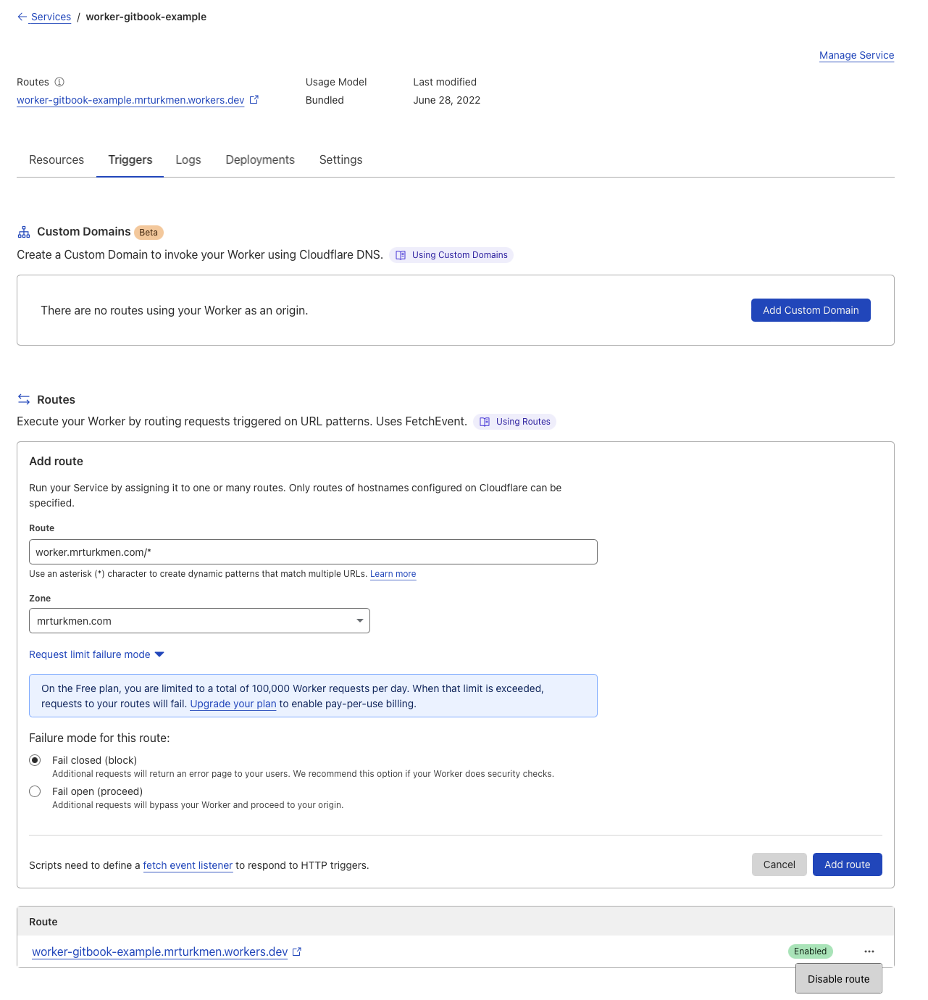
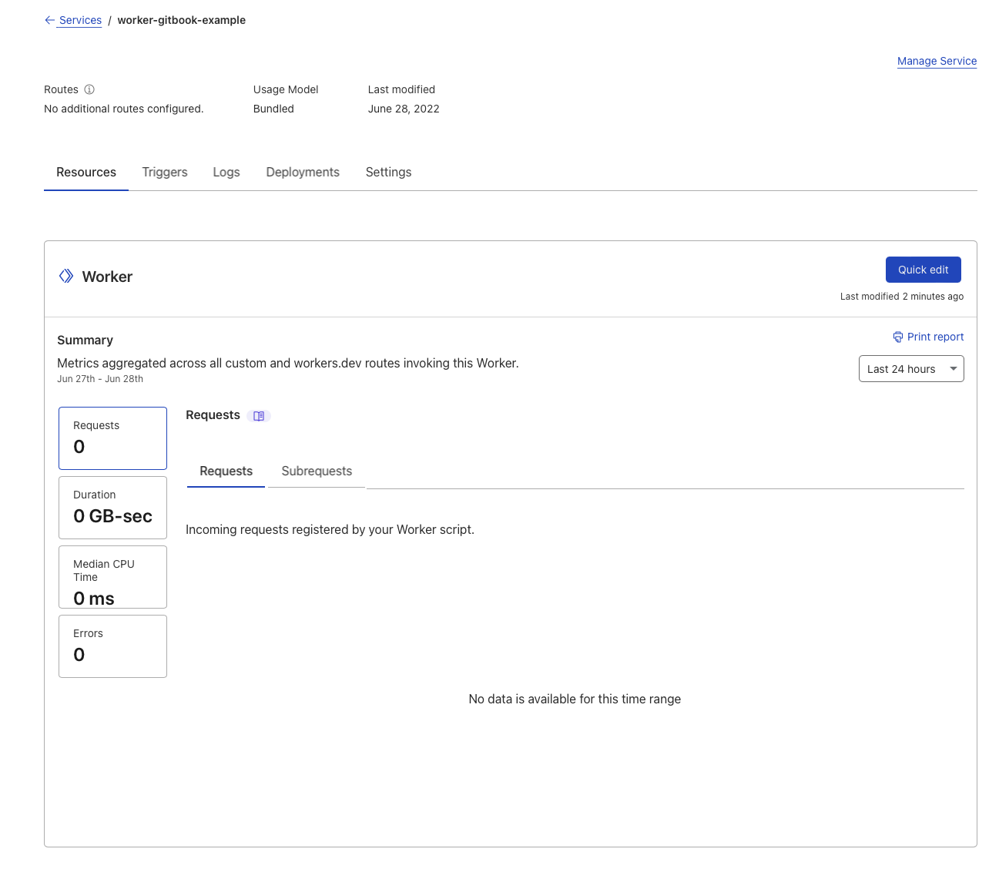
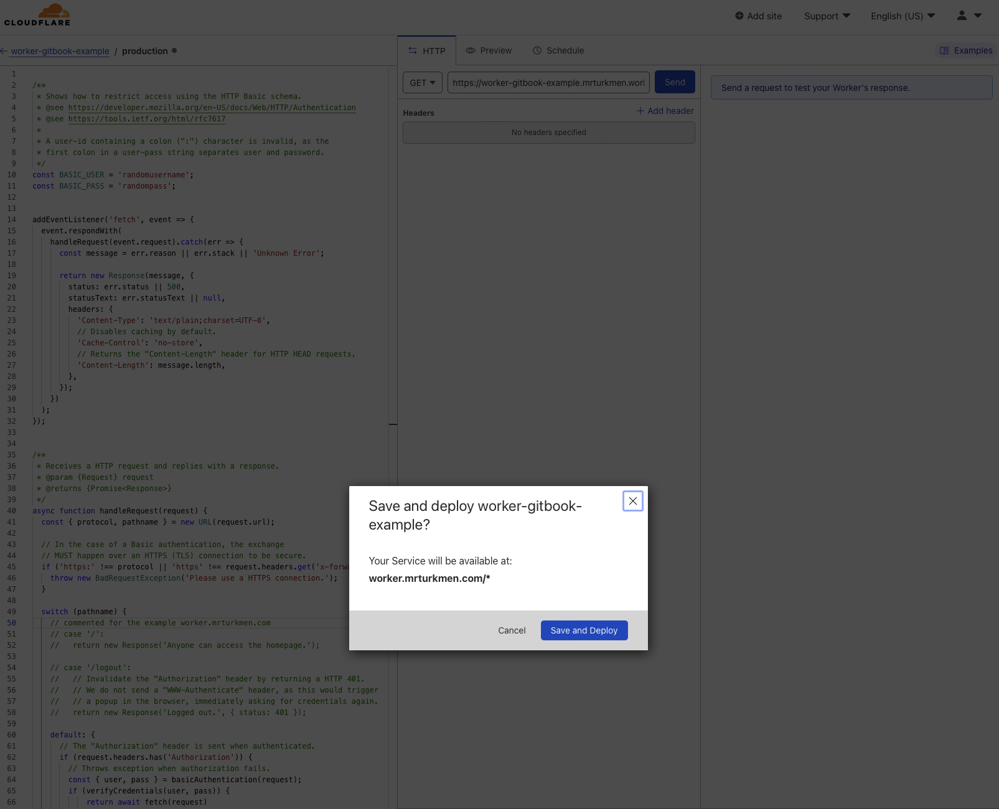

Gitbook is simple, easy and free way of keeping notes under your own domain. 
However, it is NOT possible to set password protection when you do not want anyone access to your resources except you or your team for free. (*More information: https://docs.gitbook.com/features/visitor-authentication*) Nice news is that it is possible to set password protection even though you are on free tier with some tricks. 

First of all, for this example, your custom domain should be configured to Cloudflare, since I will use Cloudflare Workers to setup Basic Authentication in between you and Gitbook origin. 

I assumed that your custom domain is already configured with Cloudflare, if not, configure it, if you want to use Cloudflare Workers feature. 

Cloudflare worker has some request limitation in free tier *(Accounts using the Workers Free plan are subject to a daily request limit of 100,000 requests.)*.
However, it is not a problem for us since we won't run e-commerce website or something. It is just private notes which is accesible from anywhere when you have the credentials. 


Here is an example code block for Basic Authentication 

(*Taken and modified from: https://developers.cloudflare.com/workers/examples/basic-auth/* )

```js


/**
 * Shows how to restrict access using the HTTP Basic schema.
 * @see https://developer.mozilla.org/en-US/docs/Web/HTTP/Authentication
 * @see https://tools.ietf.org/html/rfc7617
 *
 * A user-id containing a colon (":") character is invalid, as the
 * first colon in a user-pass string separates user and password.
 */
const BASIC_USER = 'randomusername';
const BASIC_PASS = 'randompass';


addEventListener('fetch', event => {
  event.respondWith(
    handleRequest(event.request).catch(err => {
      const message = err.reason || err.stack || 'Unknown Error';

      return new Response(message, {
        status: err.status || 500,
        statusText: err.statusText || null,
        headers: {
          'Content-Type': 'text/plain;charset=UTF-8',
          // Disables caching by default.
          'Cache-Control': 'no-store',
          // Returns the "Content-Length" header for HTTP HEAD requests.
          'Content-Length': message.length,
        },
      });
    })
  );
});


/**
 * Receives a HTTP request and replies with a response.
 * @param {Request} request
 * @returns {Promise<Response>}
 */
async function handleRequest(request) {
  const { protocol, pathname } = new URL(request.url);

  // In the case of a Basic authentication, the exchange
  // MUST happen over an HTTPS (TLS) connection to be secure.
  if ('https:' !== protocol || 'https' !== request.headers.get('x-forwarded-proto')) {
    throw new BadRequestException('Please use a HTTPS connection.');
  }

  switch (pathname) {
    
    // case '/':
    //   return new Response('Anyone can access the homepage.');

    // case '/logout':
    //   // Invalidate the "Authorization" header by returning a HTTP 401.
    //   // We do not send a "WWW-Authenticate" header, as this would trigger
    //   // a popup in the browser, immediately asking for credentials again.
    //   return new Response('Logged out.', { status: 401 });

    default: {
      // The "Authorization" header is sent when authenticated.
      if (request.headers.has('Authorization')) {
        // Throws exception when authorization fails.
        const { user, pass } = basicAuthentication(request);
        if (verifyCredentials(user, pass)) {
            return await fetch(request)
        }
      } 
      // Not authenticated.
      return new Response('You need to login.', {
          status: 401,
          headers: {
            // Prompts the user for credentials.
            'WWW-Authenticate': 'Basic realm="Private Area", charset="UTF-8"',
          },
      });
    }

    case '/favicon.ico':
    case '/robots.txt':
      return new Response(null, { status: 204 });
  }

  return new Response('Not Found.', { status: 404 });
}

function verifyCredentials(user, pass) {
  if (BASIC_USER !== user || BASIC_PASS !== pass) {
      return false 
  }
  return true 
}

/**
 * Parse HTTP Basic Authorization value.
 * @param {Request} request
 * @throws {BadRequestException}
 * @returns {{ user: string, pass: string }}
 */
function basicAuthentication(request) {
  const Authorization = request.headers.get('Authorization');

  const [scheme, encoded] = Authorization.split(' ');

  // The Authorization header must start with Basic, followed by a space.
  if (!encoded || scheme !== 'Basic') {
    throw new BadRequestException('Malformed authorization header.');
  }

  // Decodes the base64 value and performs unicode normalization.
  // @see https://datatracker.ietf.org/doc/html/rfc7613#section-3.3.2 (and #section-4.2.2)
  // @see https://dev.mozilla.org/docs/Web/JavaScript/Reference/Global_Objects/String/normalize
  const buffer = Uint8Array.from(atob(encoded), character => character.charCodeAt(0));
  const decoded = new TextDecoder().decode(buffer).normalize();

  // The username & password are split by the first colon.
  //=> example: "username:password"
  const index = decoded.indexOf(':');

  // The user & password are split by the first colon and MUST NOT contain control characters.
  // @see https://tools.ietf.org/html/rfc5234#appendix-B.1 (=> "CTL = %x00-1F / %x7F")
  if (index === -1 || /[\0-\x1F\x7F]/.test(decoded)) {
    throw new BadRequestException('Invalid authorization value.');
  }

  return {
    user: decoded.substring(0, index),
    pass: decoded.substring(index + 1),
  };
}

function UnauthorizedException(reason) {
  this.status = 401;
  this.statusText = 'Unauthorized';
  this.reason = reason;
}

function BadRequestException(reason) {
  this.status = 400;
  this.statusText = 'Bad Request';
  this.reason = reason;
}

```


This is the domain to be protected: 

https://worker.mrturkmen.com 

This subdomain contains an example Gitbook, which is synced with Github repo. 


https://github.com/merkez/worker-gitbook


You can follow steps given below from web dashboard of Cloudflare:


## Create worker service

<details>
<summary>Step 1: Create worker service</summary>
<br><br>
<pre>

</pre>
</details>


## Create trigger

<details>
<summary>Step 2: Create trigger, add route to custom domain created for Gitbook</summary>
<br><br>
<pre>

</pre>
</details>

## Edit Service 

<details>
<summary>Step 3: Edit Service, click QUICK EDIT button </summary>
<br><br>
<pre>

</pre>
</details>

## Modify Worker Code 

<details>
<summary>Step 4: Paste Authentication code to editor in left side and deploy </summary>
<br><br>
<pre>

</pre>
</details>

## Visit website


The website is only accesible with provided username and password in the example code above.

Cloudflare workers has a lot of capabilites not limited to this simple approach. More examples and information can be found in provided links below: 


- https://workers.cloudflare.com
- https://developers.cloudflare.com/workers/examples/
- https://developers.cloudflare.com/workers/examples/basic-auth/


